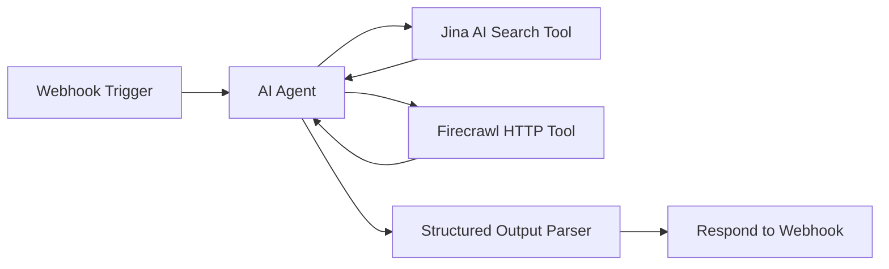
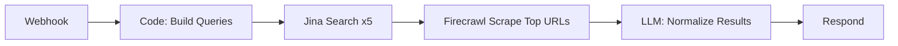

# Lifestyle Event Discovery n8n Automation

## Architecture Overview



## Input Schema (Webhook)

```json
{
  "city": "Austin",
  "state": "Texas", 
  "country": "USA",
  "start_date": "2026-01-25",
  "end_date": "2026-02-01"
}
```

## Output Schema (Normalized Events)

```json
{
  "events": [
    {
      "title": "Morning Yoga in the Park",
      "description": "Free community yoga session for all levels",
      "images": ["https://example.com/yoga.jpg"],
      "source_url": "https://meetup.com/austin-yoga/events/123",
      "tags": ["yoga", "fitness", "outdoor", "free"],
      "details": {
        "date": "2026-01-26",
        "time": "7:00 AM",
        "location": "Zilker Park, Austin TX",
        "price": "Free",
        "organizer": "Austin Yoga Community"
      }
    }
  ],
  "metadata": {
    "location": "Austin, Texas, USA",
    "date_range": "2026-01-25 to 2026-02-01",
    "total_found": 12
  }
}
```

## Workflow Nodes

### 1. Webhook Trigger

- **Path:** `/lifestyle-events`
- **Method:** POST
- **Response Mode:** Using 'Respond to Webhook' Node (allows async processing)

### 2. AI Agent (Core Logic)

- **LLM:** OpenAI GPT-4 or Google Gemini (whichever you have configured)
- **System Prompt:** Instructs the agent to:
  - Generate smart search queries for lifestyle events (fitness, yoga, running, hiking, wellness, outdoor activities, sports leagues, etc.)
  - Use Jina Search for broad discovery
  - Use Firecrawl for extracting details from promising event pages
  - Normalize all results into the required schema

### 3. Tool: Jina AI Search (Built-in)

- Searches for events like:
  - `"fitness events {city} {state} {date_range}"`
  - `"yoga classes {city} {state}"`
  - `"running clubs {city}"`
  - `"outdoor activities {city} {month} {year}"`
  - `"wellness events near {city}"`

### 4. Tool: Firecrawl HTTP Request

- **URL:** `https://api.firecrawl.dev/v1/scrape`
- **Method:** POST
- **Purpose:** Extract structured event details from URLs found via search
- **Auth:** Bearer token (your Firecrawl API key)

### 5. Structured Output Parser

- Enforces the normalized event schema
- Auto-fixes malformed AI responses

### 6. Respond to Webhook

- Returns the normalized JSON array

## Key Implementation Details

### AI Agent System Prompt (Draft)

```
You are a lifestyle event discovery assistant. Given a location and date range, find active lifestyle events including:
- Fitness classes and bootcamps
- Yoga and meditation sessions  
- Running clubs and races
- Hiking and outdoor activities
- Wellness workshops
- Sports leagues and pickup games
- Dance classes
- Swimming and water sports

TOOLS:
1. Use jina_search to find events via web search
2. Use firecrawl_scrape to extract details from event URLs

PROCESS:
1. Generate 3-5 targeted search queries for the location
2. Search and collect promising event URLs
3. Scrape top 10-15 most relevant URLs for details
4. Normalize into the required JSON format

Always include source_url so users can register/explore.
```

### Lifestyle Event Categories (Tags)

- `fitness`, `yoga`, `running`, `hiking`, `cycling`
- `swimming`, `dance`, `martial-arts`, `crossfit`
- `wellness`, `meditation`, `outdoor`, `sports`
- `free`, `paid`, `beginner-friendly`, `group`

## Credentials Needed

| Service | How to Get | Free Tier |

|---------|-----------|-----------|

| Jina AI | [jina.ai](https://jina.ai) - sign up | Yes, generous |

| Firecrawl | Already have via Rube.app | Yes |

| OpenAI/Gemini | Already have | Varies |

## Alternative: Simpler Non-Agent Approach

If you want even simpler (no AI Agent):



This uses a Code node to build search queries deterministically, then processes results with a single LLM call for normalization.

## Testing

Call the webhook with:

```bash
curl -X POST https://your-n8n.com/webhook/lifestyle-events \
  -H "Content-Type: application/json" \
  -d '{"city":"Austin","state":"Texas","country":"USA","start_date":"2026-01-25","end_date":"2026-02-01"}'
```